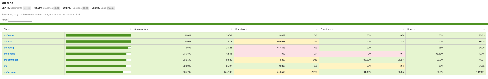

# Paul’s Express Shipping (PES)

## 📌 Project Overview
Paul’s Express Shipping is working to streamline their manual scheduling process in order to better ensure orders arrive on time and the shipping eet is being used
most effectively

## 🛠 Tech Stack
- **Node.js** - JavaScript runtime environment
- **TypeScript** - Typed superset of JavaScript
- **Express.js** - Web framework for Node.js
- **Sequelize** - ORM for managing MySQL database
- **MySQL** - Relational database management system
- **dotenv** - For managing environment variables
- **Jest / Mocha** - Testing framework (optional)

## 📁 Project Structure
```
.
|-- tsconfig.json                                       # TypeScript configuration file
|-- docs                                                # Project Docs
|   |-- postman-collections                             # Postman collection
|   |   |-- pes-app.postman_collection.json
|   |   |-- pes-app-erd.svg
|   |   |-- pes-erd-mermaid.mmd
|   |   |-- test-coverage-report.png
|-- src                                                 # Source code folder
|   |-- migrations                                      # Database migrations
|   |   |-- 2024020102-create-freight_schedule.ts
|   |   |-- 20250204165722-addFreightScheduleIdColumnOrdersTable.ts
|   |   |-- 20250204183232-addCapacityToFreightSchedule.ts
|   |   |-- 20250212035011-create-schedules.ts
|   |   |-- 20250212060040-add-schedule-id-freight-schedules-table.ts
|   |   |-- 20250212060041-remove-columns-from-freight-schedules.ts
|   |   |-- 20250212060042-create-drivers.ts
|   |   |-- 20250212060043-create-drivers-schedules.ts
|   |   |-- 20250212060044-create-freight-schedules-drivers.ts
|   |-- seeders                                          # Database seeders (initial data population)
|   |   |-- 20250212035332-schedules.ts
|   |-- index.ts                                        # Entry point of the application
|   |-- routes                                          # API route definitions
|   |   |-- orderRoutes.ts
|   |   |-- freightScheduleRoutes.ts
|   |-- config                                          # Configuration files
|   |   |-- database.ts                                 # Database connection settings
|   |   |-- sequelize.config.js                         # Sequelize configuration
|   |   |-- config.ts
|   |-- controllers                                     # Request handlers
|   |   |-- orderController.ts
|   |   |-- errorController.ts
|   |   |-- freightScheduleController.ts
|   |   |-- driverController.ts
|   |   |-- freightScheduleDriverController.ts
|   |   |-- scheduleOrderController.ts
|   |-- models                                          # Sequelize models (database schemas)
|   |   |-- index.ts
|   |   |-- order.ts
|   |   |-- driver.ts
|   |   |-- driverSchedule.ts
|   |   |-- freightSchedule.ts
|   |   |-- freightScheduleDrivers.ts
|   |-- services                                        # Business logic layer
|   |   |-- orderService.ts
|   |   |-- driverServices.ts
|   |   |-- freightScheduleService.ts
|   |   |-- freightScheduleDriverService.ts
|   |   |-- scheduleCache.ts
|   |   |-- transportService.ts
|   |-- utils                                           # Utility/helper functions
|       |-- appError.ts
|       |-- catchAsync.ts
|       |-- constants.ts
|   |-- tests                                           # End to End Integrations tests
|       |-- driverAssignment.test.ts
|       |-- drivers.test.ts
|       |-- freightSchedule.test.ts
|       |-- orders.test.ts
|       |-- scheduleOrders.test.ts
|       |-- orders.json                                 # Sample Orders Data
|       |-- freight_schedule.json                       # Sample FreightSchedule Data
|       |-- drivers.json                                # Sample Drivers Data
|-- docker-compose.yaml                                 # Docker Compose configuration
|-- Dockerfile                                          # Dockerfile for containerization
|-- package.json                                        # Node.js package configuration
|-- dist                                                # Compiled TypeScript files (generated after build)
|-- README.md                                           # Project documentation
```

## 🚀 Getting Started

### 1️⃣ Prerequisites
Ensure you have the following installed:
- **Node.js** (>= 23.x)
- **MySQL** (Running instance)
- **NPM** (Node Package manager)
- **Docker**

### 2️⃣ Installation
Clone the repository and install dependencies:
```sh
git clone https://github.com/ihemantdpatel/pes-app
cd pes-app
```
To start the Docker environment, run:
```sh
docker compose up -d
```
Notes:
On the first run, Docker will pull and build images, which may take 2-5 minutes.
This is the only command needed to start the environment after the initial setup.

### 3️⃣ Environment Configuration
Create a `.env` file in the root directory and configure it as follows:
```
NODE_ENV=
PORT=
DB_PORT=
DB_USERNAME=
DB_PASSWORD=
DB_NAME=
DB_HOST=
DB_DIALECT=
```


### 4️⃣ Database Setup
Run migrations to set up the database schema:
```sh
docker exec -it pes-app-api /bin/bash
npm run db:migrate
```
Seed initial data (Schedules data):
```sh
npm run db:seed
```

### 5️⃣ Start the Server (Local)
Run the development server:
```sh
npm run install
npm run dev
```
For production:
```sh
npm run install
npm run build
npm run start
```

## 🧪 Running Tests
To execute tests, run:
```sh
npm run test
```



## 📜 API Endpoints
| Method | Endpoint | Description |
|--------|---------|-------------|
| GET | `/api/orders` | Fetch all Orders |
| GET | `/api/freight-schedules` | Fetch all Freight Schedules |
| GET | `/api/drivers` | Fetch all Drivers |
| POST | `/api/orders` | Bulk Insert Orders |
| POST | `/api/drivers` | Bulk Insert Drivers |
| POST | `/api/freight-schedules` | Bulk Insert Freight Schedules |
| GET | `/api/freight-schedules/:id` | View Freight Schedule Details |
| POST | `/api/schedule-orders` | Assign orders to Freight Schedule |
| GET | `/api/loaded-orders/:freightSchduleId` | View orders loaded on a Freight Schedule |
| GET | `/api/freight-schedules/details` | View Freight Schedule with Orders and Drivers |
| POST | `/api/drivers/assign` | Assign drivers to Freight Schedule |
| POST | `/api/freight-schedules/:freightScheduleId/emergency-driver` | Emergency Driver Assignment |

## Postman Collection

This repository includes a Postman collection for easy API testing and documentation.

### Usage
1. Install [Postman](https://www.postman.com/downloads/).
2. Import the collection from the `docs/postman-collections/` folder.
3. Run the requests to interact with the API.